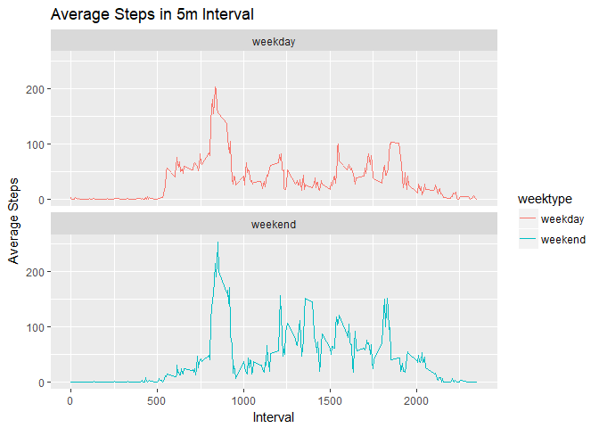

# Reproducible Research: Peer Assessment 1


## Loading and preprocessing the data


```r
#check if file exists
dataFile<-"./activity.csv"
if (!file.exists(dataFile)) { 
    stop("Dataset file not present!") 
}

#read data
activitySet<-read.csv(file = dataFile, header = TRUE)
groupActivity<-group_by(activitySet,date)
summaryActivity<-summarize(groupActivity,total=sum(steps,na.rm = TRUE))
```


## What is mean total number of steps taken per day?
- Make a histogram of the total number of steps taken each day

```r
groupActivity<-group_by(activitySet,date)
summaryActivity<-summarize(groupActivity,total=sum(steps,na.rm = TRUE))
hist(summaryActivity$total,main="Histogram for Total Steps per Day",xlab="Total Steps")
```

<!-- -->

- Calculate and report the mean of the total number of steps taken

```r
meanSteps<-mean(summaryActivity$total,na.rm = TRUE)
meanSteps
```

```
## [1] 9354.23
```

- Calculate and report the median of the total number of steps taken

```r
medianSteps<-median(summaryActivity$total,na.rm = TRUE)
medianSteps
```

```
## [1] 10395
```

## What is the average daily activity pattern?
- Make a time series plot (i.e. type = "l") of the 5-minute interval (x-axis)

```r
interval <- activitySet %>%
    filter(!is.na(steps)) %>%
    group_by(interval) %>%
    summarize(steps = mean(steps))
pl<-ggplot(interval, aes(interval,steps)) 
pl + labs(x="Interval",y ="Average Steps", 
          title ="Average Steps in 5m Interval") + geom_line()
```

<!-- -->

- Which 5-minute interval, on average across all the days in the dataset, contains the maximum number of steps?

```r
interval$interval[which.max(interval$steps)]
```

```
## [1] 835
```


## Imputing missing values
 - Calculate and report the total number of missing values in the dataset (i.e. the total number of rows with NAs)
 
 ```r
 totalNA<-as.numeric(count(activitySet[is.na(activitySet),]))
 totalNA
 ```
 
 ```
 ## [1] 2304
 ```
- Replace NA values with Mean

```r
activitySetFinal <- activitySet
activityNA <- is.na(activitySetFinal$steps)
avg_interval <- tapply(activitySetFinal$steps, activitySetFinal$interval, mean, na.rm=TRUE, simplify=TRUE)
activitySetFinal$steps[activityNA] <- avg_interval[as.character(activitySetFinal$interval[activityNA])]
```

- Make a histogram of the total number of steps taken each day

```r
groupActivityFinal<-group_by(activitySetFinal,date)
summaryActivityFinal<-summarize(groupActivityFinal,total=sum(steps))
hist(summaryActivityFinal$total,main="Histogram for Total Steps per Day without NA",xlab="Total Steps")
```

<!-- -->

- Calculate and report the mean total number of steps taken per day.

```r
meanSteps<-mean(summaryActivityFinal$total)
meanSteps
```

```
## [1] 10766.19
```

- Calculate and report the median total number of steps taken per day.

```r
medianSteps<-median(summaryActivityFinal$total)
medianSteps
```

```
## [1] 10766.19
```


## Are there differences in activity patterns between weekdays and weekends?
- Create a new factor variable in the dataset with two levels - "weekday" and "weekend" indicating whether a given date is a weekday or weekend day.

```r
activitySetFinal$weektype<-sapply(activitySetFinal$date,FUN=function(x){ if ( wday(x) == 7 | wday(x) == 6 ) { "weekend" } else { "weekday"} })
head(activitySetFinal)
```

```
##       steps       date interval weektype
## 1 1.7169811 2012-10-01        0  weekday
## 2 0.3396226 2012-10-01        5  weekday
## 3 0.1320755 2012-10-01       10  weekday
## 4 0.1509434 2012-10-01       15  weekday
## 5 0.0754717 2012-10-01       20  weekday
## 6 2.0943396 2012-10-01       25  weekday
```

- Make a panel plot containing a time series plot (i.e. type = "l") of the 5-minute interval (x-axis) and the average number of steps taken, averaged across all weekday days or weekend days (y-axis). 

```r
intervalFinal <- activitySetFinal %>%
    filter(!is.na(steps)) %>%
    group_by(interval,weektype) %>%
    summarize(steps = mean(steps))
pl<-ggplot(intervalFinal, aes(interval,steps,
                         color=weektype)) 
pl + labs(x="Interval",y ="Average Steps", 
          title ="Average Steps in 5m Interval") + 
    geom_line() + 
    facet_wrap(~weektype, ncol = 1, nrow=2)
```

<!-- -->
